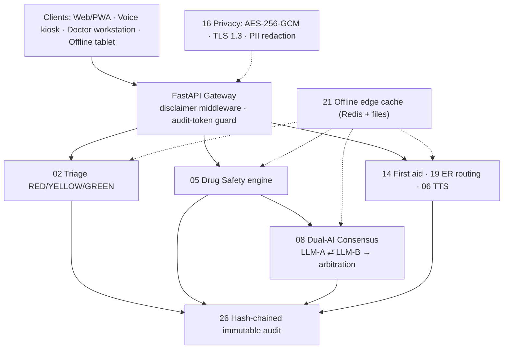

# 🏥 AuraMed — AI-Powered Medical Assistant

[](https://github.com/BFH-HAMID/AuraMed-Ai-Powered-Medical-Assistant/actions/workflows/ci.yml)

**A 26-point integrated AI medical architecture for localized, edge-deployable
clinical decision support — with Bengali (বাংলা) language support, speech
processing, handwriting OCR, emergency triage and full offline resilience.**

> ⚠️ **MANDATORY SAFETY NOTICE (enforced on every output):**
> *"AuraMed AI output is for decision-support only; requires licensed
> physician review before clinical action."*
>
> The disclaimer is enforced in **three** places: every API **response body**
> (`disclaimer`), every **HTTP response header** (`X-AuraMed-Disclaimer`), and
> the **spoken TTS preamble** (Node 06). AuraMed never auto-prescribes.

---

## 📋 The 26 Nodes

### 1 · Input & Initial Processing
| # | Node | Status |
|---|---|---|
| 01 | **Audio STT & regional Bengali dialects** — Whisper (cloud) / VOSK (offline), noise filtering | integration stub |
| 02 | **Emergency Triage & Red-Flag Detection** — RED/YELLOW/GREEN from symptoms + vitals | ✅ production |
| 03 | **Custom Reader** — clinical text ingestion (native text; PDF/DOCX optional) | ✅ |
| 04 | **Handwritten Prescription OCR** — TrOCR/Tesseract + confidence verification policy | integration stub |
| 05 | **Drug Safety & Allergy Check** — drug-drug, allergy cross-reactivity, renal (eGFR), cardiac (QT/K⁺), pregnancy, duplicates | ✅ production |
| 06 | **TTS Output** — bilingual audio scripts, spoken disclaimer preamble (edge-tts/Piper) | ✅ script engine |
| 07 | **Multi-Source Report Comparison** — lab deltas, % change, range/trend flags | ✅ |

### 2 · Core AI & Data Pipeline
| # | Node | Status |
|---|---|---|
| 08 | **Second Opinion & Dual-AI Consensus** — two independent clinical LLMs, arbitration, hallucination guard, fail-safe degradation | ✅ production |
| 09 | **Patient History & Vitals** — EHR/FHIR-style structured ingestion, BMI, timeline | ✅ |
| 10 | **Data Synthesis & Preparation** — unit harmonization, PII anonymization, feature blocks | ✅ |

### 3 · Risk Assessment & Diagnostics
| # | Node | Status |
|---|---|---|
| 11 | **Health Risk Predictor** — transparent CVD / diabetes / CKD scores | ✅ |
| 12 | **Medicine Leaflets** — bilingual patient-friendly drug information | ✅ |
| 13 | **Prescription & Guidelines Engine** — structured clinical drafts (physician sign-off) | ✅ |
| 14 | **First-Aid & Emergency Guidebook** — bilingual step-by-step protocols, fully offline | ✅ production |
| 15 | **Lab Test Recommendations** — symptom-driven investigation suggestions | ✅ |

### 4 · Security, Infrastructure & Compliance
| # | Node | Status |
|---|---|---|
| 16 | **Privacy & HIPAA/GDPR** — AES-256-GCM at rest, TLS 1.3, PII redaction (BD phone/NID, Bengali digits) | ✅ |
| 17 | **Simplified Patient Explanation** — jargon → plain Bengali/English | ✅ |
| 18 | **Diet & Lifestyle Guide** — culturally regional (Bengali plate) plans | ✅ |
| 19 | **Emergency Proximity Routing** — nearest ER/ambulance via local geo directory | ✅ production |
| 20 | **Multi-Language Chatbot** — Bengali/English, red-flag-gated conversational triage | ✅ |

### 5 · Offline Accessibility & Feedback Loop
| # | Node | Status |
|---|---|---|
| 21 | **Offline Node & Edge Cache** — Redis + file cache; safety nodes run with no internet | ✅ |
| 22 | **Interactive Symptom Tracker** — bilingual decision-tree/flowchart | ✅ |
| 23 | **Verified Home Remedies** — safe non-pharmacological tips with hard red-flag gate | ✅ |
| 24 | **Doctor Feedback Loop** — corrections logged → fine-tuning pipeline (offline queue) | ✅ |
| 25 | **Alternative/Conservative Care** — non-emergency care plans (refuses RED) | ✅ |
| 26 | **Regulatory Audit Logging** — immutable SHA-256 hash-chained JSONL, token-guarded | ✅ production |

Nodes **01** and **04** ship as documented integration stubs (their heavy ML
runtimes — Whisper/VOSK/TrOCR — attach on GPU/edge nodes); every other node is
functional with deterministic, offline-safe logic. See
[`docs/architecture.md`](docs/architecture.md).

---

## 🚀 Quickstart

```bash
# 1) Install
pip install -r requirements.txt

# 2) Configure (optional — runs with safe local defaults)
cp .env.example .env

# 3) Run
uvicorn backend.main:app --host 0.0.0.0 --port 8000
```

* Swagger UI → http://localhost:8000/docs
* Health → http://localhost:8000/health
* Docker stack (API + PostgreSQL + Redis) → `docker compose up --build`

### Try it

```bash
# Emergency triage (Bengali chest pain → RED)
curl -X POST http://localhost:8000/api/v1/02/triage \
  -H 'Content-Type: application/json' \
  -d '{"symptoms_text":"বুকে চাপ আর বাম বাহুতে ব্যথা, প্রচণ্ড ঘাম","language":"bn"}'

# Drug safety — catches warfarin + ibuprofen (critical)
curl -X POST http://localhost:8000/api/v1/05/drug-safety \
  -H 'Content-Type: application/json' \
  -d '{"medications":[{"name":"warfarin"},{"name":"ibuprofen"}],
       "patient":{"renal_egfr":25,"allergies":["penicillin"]}}'

# Dual-AI consensus (English heart-attack scenario)
curl -X POST http://localhost:8000/api/v1/08/consensus \
  -H 'Content-Type: application/json' \
  -d '{"case_text":"60yo male, crushing chest pain radiating to left arm, sweating"}'
```

```bash
python3 -m pytest tests/      # 131 tests, all green
```

---

## 🏗️ Architecture overview



Full diagrams (5 Mermaid views): **[docs/architecture.md](docs/architecture.md)**
— system map, triage flow, consensus sequence, security, edge deployment.

---

## 🔬 Production engine deep-dives

* **Node 08 — Dual-AI Consensus:** two independent models (sensitivity-weighted
  "A" vs specificity-weighted "B"; cloud clinical LLMs or deterministic local
  personas), concurrent inference with timeouts, agreement scoring
  (`0.40·risk + 0.35·primary-dx + 0.25·differential Jaccard`), hallucination
  guard for unverified drug/dose claims, forced physician escalation on
  divergence/red flags/fallback use.
  → [docs/consensus-engine.md](docs/consensus-engine.md) · `backend/nodes/node_08_consensus/`
* **Node 05 — Drug Safety:** 28-drug formulary with Bengali aliases, 36
  severity-graded interactions (warfarin+NSAID, sildenafil+nitrate,
  ACEi+TMP-SMX…), allergy class cross-reactivity, eGFR renal cutoffs, cardiac
  flags (QT, bleeding, K⁺), pregnancy & duplicate therapy; hard-stop on
  critical/high findings.
  → [docs/drug-safety.md](docs/drug-safety.md) · `backend/nodes/node_05_drug_safety/`

API reference: **[docs/api-gateway.md](docs/api-gateway.md)** · Deployment:
**[docs/DEPLOYMENT.md](docs/DEPLOYMENT.md)**

---

## 🗂️ Repository layout

```
backend/
├── main.py                      # FastAPI app + safety middleware
├── config.py                    # env-driven settings
├── core/                        # disclaimer · i18n (bn/en) · schemas · audit (Node 26)
│                                #   security/crypto (Node 16) · edge cache (Node 21)
├── api/                         # routers for the 5 architecture layers
└── nodes/
    ├── node_02_triage/          # production triage engine + bilingual red-flag rules
    ├── node_05_drug_safety/     # production drug safety engine + KB
    ├── node_08_consensus/       # production dual-AI consensus + LLM clients
    ├── node_14_first_aid/       # bilingual first-aid protocols
    ├── node_19_routing/         # geo emergency routing
    ├── node_23_remedies/        # verified home remedies
    └── node_*.py                # all remaining nodes
data/                            # clinical knowledge JSON (drug KB, red flags,
                                 #   first aid, home remedies, facilities)
docs/                            # architecture (Mermaid) + engineering + API + deployment
tests/                           # 131 pytest tests — nodes 02/05/08/23 + a
                                 #   whole-gateway contract suite (every route)
```

---

## 🧭 Tech stack

Python 3.11 · **FastAPI** · **Pydantic v2** · Uvicorn · httpx · Redis ·
PostgreSQL (SQLAlchemy optional) · `cryptography` (AES-256-GCM) ·
**PyTorch/Transformers + TrOCR** (OCR) · **Whisper/VOSK** (STT) ·
Tesseract (edge OCR) · Docker Compose.

## 🔐 Safety & compliance guardrails

1. Mandatory physician-review disclaimer on **every** output (body + header + voice).
2. RED triage always wins — chatbot, remedies and conservative-care nodes
   refuse non-emergency advice on red flags.
3. Critical/high drug-safety findings hard-stop (`safe_to_proceed=false`).
4. LLM consensus escalates to a physician on divergence, single-model,
   fallback, low confidence, red flags, or unverified drug claims.
5. PII is anonymized before any LLM call; PHI is never written to audit logs
   (counts/summaries only); audit trail is hash-chained and tamper-evident.

---

## 📄 License

See [LICENSE](LICENSE). AuraMed is a decision-support framework — it does not
replace licensed clinical judgement.
