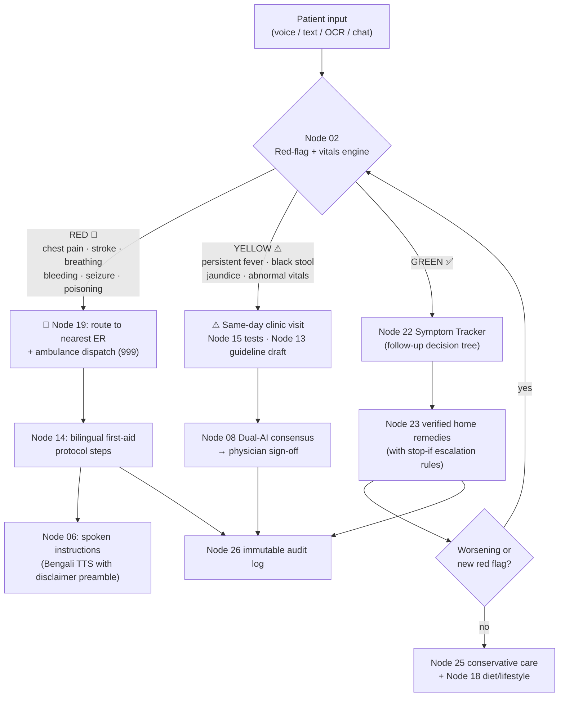
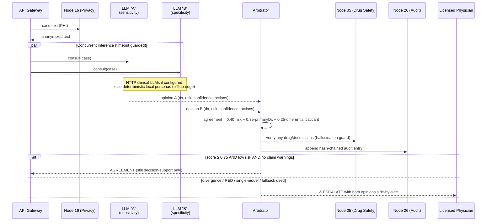
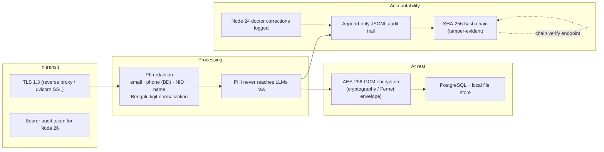
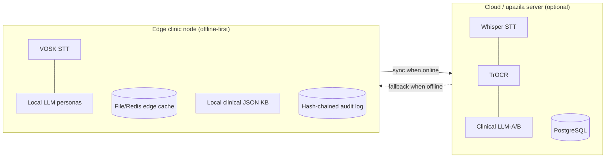

# AuraMed System Architecture

> **Mandatory safety notice:** *AuraMed AI output is for decision-support only;
> requires licensed physician review before clinical action.* Every API
> response enforces this in the body (`disclaimer`), HTTP header
> (`X-AuraMed-Disclaimer`) and spoken TTS preamble.

AuraMed is a 26-node integrated medical AI platform designed for localized,
edge-friendly deployment in Bengali (বাংলা) + English settings (community
clinics, upazila health complexes, ambulances, offline tablets).

---

## 1. High-Level System Architecture

```mermaid
flowchart TB
    subgraph CLIENTS["🎙️ Clients (Bengali / English)"]
        direction LR
        WEB["Web / Mobile UI<br/>(PWA, works offline)"]
        VOICE["Voice Kiosk<br/>(illiterate / visually impaired)"]
        DOC["Doctor Workstation"]
        EDGE["Edge Tablet<br/>(offline clinic node)"]
    end

    subgraph GATEWAY["API GATEWAY — FastAPI"]
        GW["REST /api/v1/NN/*<br/>CORS · rate-limit · audit-token guard"]
        MID["Safety Middleware<br/>disclaimer header · PII guard · error fallback"]
    end

    subgraph L1["1 · INPUT & INITIAL PROCESSING"]
        N01["01 STT (Whisper/VOSK)<br/>Bengali dialects + noise filter"]
        N02["02 Emergency Triage<br/>RED / YELLOW / GREEN"]
        N03["03 Document Reader"]
        N04["04 Handwriting OCR<br/>(TrOCR + confidence)"]
        N05["05 Drug Safety & Allergy"]
        N06["06 TTS Output"]
        N07["07 Report Comparison"]
    end

    subgraph L2["2 · CORE AI & DATA PIPELINE"]
        N08["08 Dual-AI Consensus<br/>LLM-A + LLM-B → arbitration"]
        N09["09 EHR / Vitals / Family Hx"]
        N10["10 Data Synthesis<br/>(normalize · anonymize)"]
    end

    subgraph L3["3 · RISK & DIAGNOSTICS"]
        N11["11 Risk Predictor<br/>(CVD / DM / CKD)"]
        N12["12 Drug Leaflets"]
        N13["13 Guidelines Engine"]
        N14["14 First-Aid Guidebook"]
        N15["15 Lab Test Recommender"]
    end

    subgraph L4["4 · SECURITY, INFRA & COMPLIANCE"]
        N16["16 Privacy: AES-256-GCM<br/>TLS 1.3 · HIPAA/GDPR"]
        N17["17 Plain-Language NLG"]
        N18["18 Diet & Lifestyle"]
        N19["19 Emergency Proximity<br/>Routing (geo)"]
        N20["20 Bengali/English Chatbot"]
    end

    subgraph L5["5 · OFFLINE & FEEDBACK LOOP"]
        N21["21 Offline Node +<br/>Local Edge Cache"]
        N22["22 Symptom Tracker<br/>(decision tree)"]
        N23["23 Verified Home Remedies"]
        N24["24 Doctor Feedback<br/>(fine-tune loop)"]
        N25["25 Conservative Care Plans"]
        N26["26 Immutable Audit Log<br/>(hash-chained JSONL)"]
    end

    subgraph DATA["STORAGE / KNOWLEDGE"]
        PG[("PostgreSQL<br/>EHR · patients · telemetry")]
        REDIS[("Redis + File Cache<br/>offline knowledge base")]
        KB["Clinical Knowledge JSON<br/>drugs · red flags · first aid<br/>facilities · remedies"]
    end

    WEB & VOICE & DOC & EDGE --> GW
    GW --> MID --> N01 & N02 & N03 & N04
    N01 --> N02
    N02 -->|RED 🚨| N14 & N19
    N04 --> N05
    N02 --> N10 --> N08
    N03 & N07 & N09 --> N10
    N08 --> N11 & N13 & N15
    N05 --> N13
    N08 --> N17 --> N06
    N13 --> N12
    N11 --> N18 & N25
    N02 -->|GREEN| N22 & N23 & N20
    N20 --> N02
    N14 & N23 & N19 --> N06
    DOC -->|corrections| N24
    N24 --> N08
    L1 & L2 & L3 & L4 & L5 --> N26
    N16 -.->|encryption / anonymization| L1 & L2
    N21 -.->|powers offline| N02 & N05 & N08 & N14 & N19 & N23
    N08 & N09 --> PG
    N21 --> REDIS
    L1 & L2 & L3 --> KB
```

---

## 2. Node Map (5 layers, 26 nodes)

| Layer | Nodes |
|---|---|
| **1. Input & Initial Processing** | 01 STT · 02 Triage · 03 Reader · 04 OCR · 05 Drug Safety · 06 TTS · 07 Report Comparison |
| **2. Core AI & Data Pipeline** | 08 Dual-AI Consensus · 09 EHR/Vitals · 10 Synthesis |
| **3. Risk & Diagnostics** | 11 Risk Scores · 12 Leaflets · 13 Guidelines · 14 First Aid · 15 Lab Tests |
| **4. Security, Infra & Compliance** | 16 Privacy/HIPAA · 17 Plain-Language NLG · 18 Diet · 19 Emergency Routing · 20 Chatbot |
| **5. Offline & Feedback Loop** | 21 Offline Cache · 22 Symptom Tracker · 23 Home Remedies · 24 Doctor Feedback · 25 Alt Care · 26 Audit Log |

---

## 3. Emergency Triage Flow (Node 02 → 14 → 19)

---

## 4. Dual-AI Consensus Engine (Node 08)

See [`docs/consensus-engine.md`](./consensus-engine.md) for the detailed
sequence, agreement scoring and fail-safe behavior.

---

## 5. Data Security & Compliance (Nodes 16 + 26)

---

## 6. Edge / Offline Deployment (Node 21)

Safety-critical nodes run **without internet** from local JSON knowledge bases
and deterministic engines:

**Offline-capable:** 02 triage · 05 drug safety · 08 consensus (local
personas) · 10 synthesis · 11 risk scores · 12 leaflets · 13 guideline drafts ·
14 first aid · 16 anonymization · 17 explainer · 18 diet · 19 routing ·
20 chatbot · 21 cache · 22 tracker · 23 remedies · 26 audit.

**Cloud/accelerated when available:** 01 Whisper STT (VOSK is offline
alternative) · 04 TrOCR (Tesseract edge fallback) · 06 neural TTS · 09 EHR
PostgreSQL sync · 24 telemetry sync.

