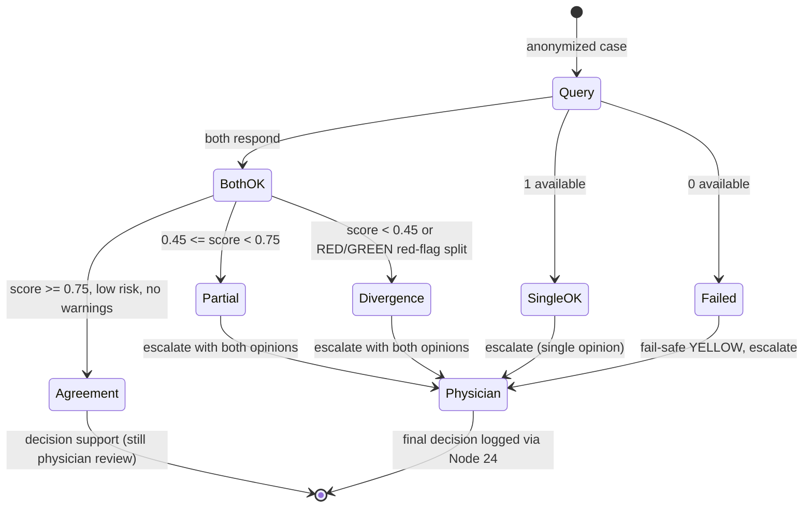

# Node 08 — Second Opinion & Dual-AI Consensus Engine (Engineering)

Source: `backend/nodes/node_08_consensus/`

> *AuraMed AI output is for decision-support only; requires licensed physician
> review before clinical action.*

## Why dual models

A single clinical LLM can hallucinate with high confidence. Node 08 runs **two
independent reasoning models** over the same anonymized case and arbitrates
their opinions. Independence comes from:

| Aspect | Model A (`local-clinician-a`) | Model B (`local-clinician-b`) |
|---|---|---|
| Bias | high **sensitivity** (over-calls risk) | high **specificity** (requires strong evidence) |
| Local persona | single benign cue → YELLOW | ≥2 benign cue groups → YELLOW |
| Probability weighting | gain 0.42/cue × 1.12 | gain 0.34/cue × 0.92; single-cue discount |
| Cloud deployment | OpenAI-compatible endpoint A (independent model weights/training) | endpoint B (different family/provider) |
| Red flags | **identical** — danger is never down-weighted | **identical** |

## Pipeline

1. **Anonymization (Node 16 hook)** — `anonymize_text()` strips email, BD phone
   numbers (`+880/01…` including Bengali digits), national IDs and name
   phrases before *either* model sees the case.
2. **Concurrent inference** — `asyncio.wait_for` around each client (timeout
   15 s, plus the HTTP client timeout). Cloud models are used when
   `AURAMED_LLM_A_ENDPOINT` / `AURAMED_LLM_B_ENDPOINT` are set; otherwise the
   deterministic local personas run (offline edge).
3. **Graceful degradation** — a failed cloud call falls back to that persona's
   local twin; the opinion is labelled `[fallback after error: ...]` and
   `local_fallback_used=True` **forces physician escalation**. If the fallback
   also fails, the opinion is marked `available=False`.
4. **Hallucination guard** — `scan_unverified_claims()` flags:
   * any specific dosage (`50 mg`, `2 tablets`) inside free-text advice,
   * any formulary drug name (resolved via the Node 05 KB) inside advice.

   Such claims always trigger escalation; dosing must go through Node 05 + the
   physician — never free-text LLM output.
5. **Arbitration** —

   ```
   agreement = 0.40 · risk_score        (green==  → 1.0; 1 level gap → 0.55; red↔green → 0.1)
             + 0.35 · primary_dx_score  (same primary key → 1.0)
             + 0.25 · differential_jaccard over diagnoses with p ≥ 0.3
   ```

   | Score | State |
   |---|---|
   | ≥ 0.75 | `AGREEMENT` |
   | 0.45–0.74 | `PARTIAL` |
   | < 0.45 | `DIVERGENCE` |

   **Safety override:** if any red flag exists and one model says RED while the
   other says GREEN, state is forced to `DIVERGENCE`.
6. **Consensus outputs** — merged differential (mean probability per key),
   consensus actions = *intersection* on agreement / *union* otherwise.
7. **Escalation policy** — physician review is mandatory when ANY of:
   `DIVERGENCE / SINGLE_MODEL / FAILED`, risk = RED, claim warnings present,
   `local_fallback_used`, or consensus confidence < 0.65.
8. **Audit (Node 26)** — every consultation appends a hash-chained entry:
   state, score, confidence, risk, both model IDs, fallback flag, PII fields
   redacted counts, claim-warning count.

## Consensus state machine



## Attaching real clinical LLMs

Deploy two independent OpenAI-compatible servers (vLLM / Ollama / hosted) and
set (see `.env.example`):

```bash
AURAMED_LLM_A_ENDPOINT=https://llm-a.internal/v1/chat/completions
AURAMED_LLM_A_KEY=...
AURAMED_LLM_B_ENDPOINT=https://llm-b.internal/v1/chat/completions
AURAMED_LLM_B_KEY=...
```

The system prompt (`llm_clients._SYSTEM_PROMPT`) forces strict JSON output
matching `ModelOpinion` (`primary_diagnosis`, `differential`, `risk_level`,
`confidence`, `red_flags`, `recommended_actions`, `rationale`,
`requests_more_info`). Malformed JSON / network errors trigger local fallback
automatically.

## Tests

`tests/test_node08_consensus.py` covers: red-flag agreement (EN + BN),
low-risk agreement, persona disagreement on YELLOW threshold, single-model
degradation, total failure fail-safe, hallucination guard (dose + drug name),
and PII redaction before inference.
