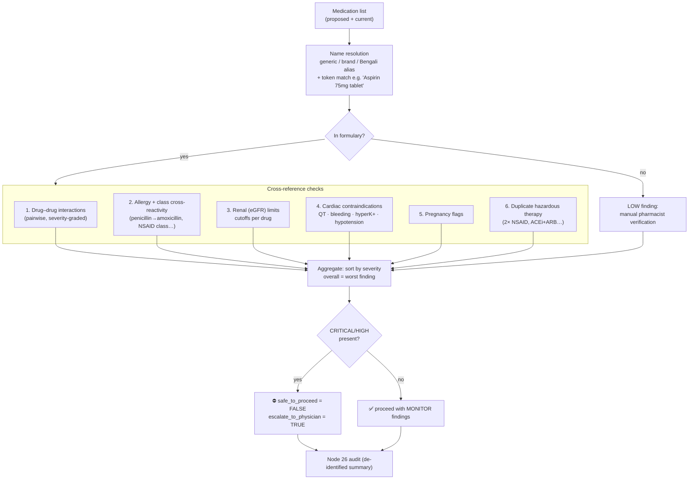

# Node 05 — Drug Safety & Allergy Check (Engineering)

Source: `backend/nodes/node_05_drug_safety/`
Knowledge base: `backend/data/drug_kb.json` (28 drugs, 36 interaction rules,
Bengali aliases + cross-reactivity classes)

> *AuraMed AI output is for decision-support only; requires licensed physician
> review before clinical action.*

## Checks performed (in order)



## Finding model

Every finding is structured (`SafetyFinding`):

| Field | Example |
|---|---|
| `severity` | `critical` / `high` / `moderate` / `low` / `info` |
| `category` | `drug_drug_interaction`, `allergy`, `renal`, `cardiac`, `pregnancy`, `duplicate`, `unknown_drug` |
| `drugs` | `["warfarin", "ibuprofen"]` |
| `title_en` / `title_bn` | bilingual titles |
| `detail_en` / `detail_bn` | mechanism of the problem |
| `recommendation_en` / `recommendation_bn` | required action |
| `action` | `stop_and_review` (hard) / `monitor` / `avoid` / `info` |

Hard rule: any **critical/high** finding sets `safe_to_proceed=false`.

## Clinical rules encoded (samples)

| Rule | Severity | Rationale |
|---|---|---|
| sildenafil + nitroglycerin | critical | catastrophic hypotension — absolute contraindication |
| warfarin + ibuprofen / naproxen / diclofenac | critical | GI hemorrhage |
| warfarin + fluconazole | critical | sharp INR rise (CYP2C9) |
| ACEi/ARB + co-trimoxazole / spironolactone | critical–high | life-threatening hyperkalemia / AKI |
| clopidogrel + omeprazole | high | CYP2C19 blocks activation (use pantoprazole) |
| ciprofloxacin + ondansetron (+ other QT drugs) | high | additive QT prolongation |
| metformin at eGFR < 30 | high | lactic acidosis risk |
| fluoroquinolone + long-QT history | high | arrhythmia |
| penicillin allergy → amoxicillin | critical | class cross-reactivity |
| enalapril/losartan/statin in pregnancy | high–critical | fetal harm |
| two NSAIDs simultaneously | high | duplicate class |

Unknown drugs are **never silently ignored**: they lower confidence and emit a
verification finding. Confidence = `known/total` minus a finding penalty.

## Request/response example

```bash
curl -X POST http://localhost:8000/api/v1/05/drug-safety \
  -H 'Content-Type: application/json' \
  -d '{
    "medications": [{"name": "warfarin"}, {"name": "ibuprofen"}],
    "patient": {"allergies": ["penicillin"], "renal_egfr": 25,
                "conditions": ["CKD stage 4"]},
    "language": "en"
  }'
```

Key response fields:

```jsonc
{
  "node": 5,
  "risk_level": "red",
  "confidence": 0.79,
  "data": {
    "overall_severity": "critical",
    "safe_to_proceed": false,
    "escalate_to_physician": true,
    "findings": [
      {"category": "drug_drug_interaction", "severity": "critical",
       "title_en": "Critical interaction: Warfarin + Ibuprofen",
       "action": "stop_and_review", ...},
      {"category": "renal", "severity": "high", "drugs": ["metformin"], ...}
    ],
    "unknown_medications": [],
    "summary_en": "Checked 2 medication(s): ... DO NOT proceed ..."
  },
  "disclaimer": "AuraMed AI output is for decision-support only; requires licensed physician review before clinical action."
}
```

## Extending the knowledge base

Add entries to `backend/data/drug_kb.json`:

* `drugs.<key>` — aliases (include Bengali brand names), `drug_class`,
  `renal_cutoff_egfr`, `cardiac_flags`, `pregnancy_flag`, `notes`;
* `interactions[]` — `{a, b, severity, mechanism, action, bn}`;
* `allergy_cross_reactivity` — class → canonical drug keys;
* `cardiac_flag_guidance` — bilingual guidance per flag.

No code changes are needed; the alias index is rebuilt on first use. Every
check is audited (Node 26) with a de-identified summary only.

## Tests

`tests/test_node05_drug_safety.py` covers alias/brand/Bengali resolution,
critical hard-stops, sildenafil+nitrate, unknown drugs, allergy
cross-reactivity (incl. NSAID class), eGFR cutoffs, QT stacking, pregnancy,
duplicate therapy, confidence scoring and bilingual output.
